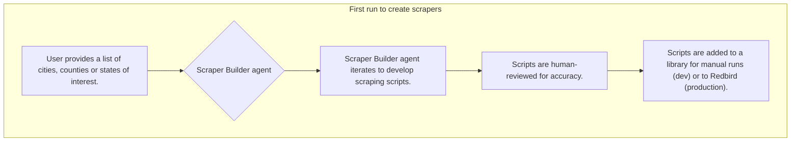
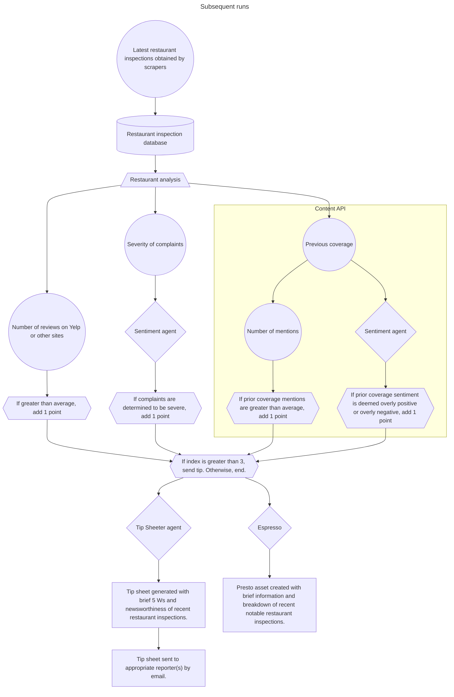
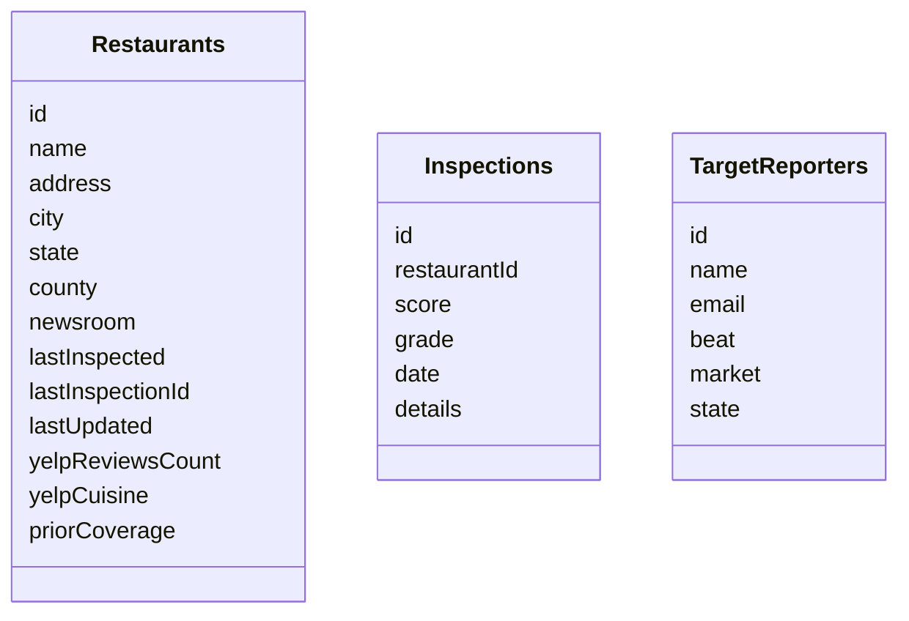
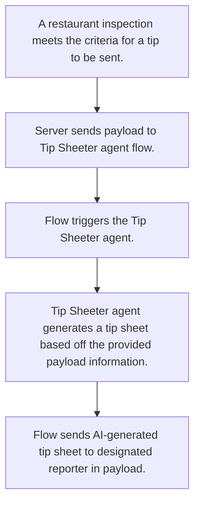

# Restaurant inspections

## Workflow

## Database

In this demo, the database uses SQLite and FastAPI for easy testing with Copilot Studio.

In production, the data would be stored as part of a larger data pool for access by other scrapers and workflows. Redbird may also be factored in for deployment.

Three primary tables are constructed: 

* **restaurants**, which includes all necessary information about the individual establishments being scraped;
* **inspections**, which includes each individual inspection scraped by the tool; and
* **target reporters**, a proxy table to fill in for a tool that identifies the appropriate reporter a tip should be routed toward.

## Tip Sheeter agent schema

