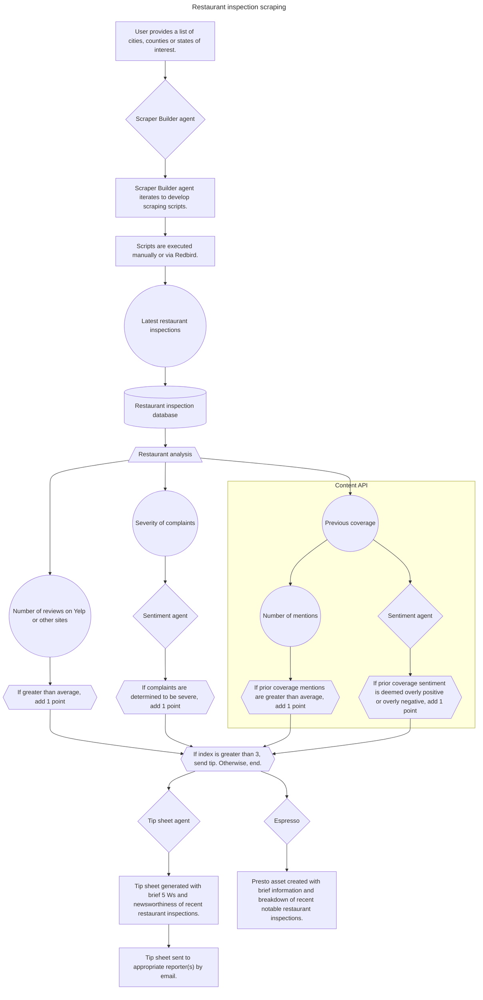

# Restaurant inspections

## Workflow

```mermaid
---
title: Restaurant inspection scraping
---
flowchart TB
    1[User provides a list of cities, counties or states of interest.]
    2{Scraper Builder agent}
    3[Scraper Builder agent iterates to develop scraping scripts.]
    4[Scripts are executed manually or via Redbird.]
    5((Latest restaurant inspections))
    6[(Restaurant inspection database)]
    7[/Restaurant analysis\]
    7a((Number of reviews on Yelp or other sites))
    7aa{{If greater than average, add 1 point}}    
    7b2((Previous coverage))    
    7ba((Number of mentions))    
    7baa{{If prior coverage mentions are greater than average, add 1 point}}
    7bb{Sentiment agent}
    7bba{{If prior coverage sentiment is deemed overly positive or overly negative, add 1 point}}                      
    7c((Severity of complaints))
    7ca{Sentiment agent}
    7cb{{If complaints are determined to be severe, add 1 point}}
    8{{If index is greater than 3, send tip. Otherwise, end.}}                                            
    9{Tip sheet agent}
    10[Tip sheet generated with brief 5 Ws and newsworthiness of recent restaurant inspections.]
    9a{Espresso}
    9aa[Presto asset created with brief information and breakdown of recent notable restaurant inspections.]
    11["Tip sheet sent to appropriate reporter(s) by email."]
              
1-->2
2-->3
3-->4
4-->5
5-->6
6-->7
7-->7a
7-->7b2
7-->7c
7a-->7aa
subgraph Content API
7b2-->7ba
7ba-->7baa
7bb-->7bba
7b2-->7bb
end
7c-->7ca
7ca-->7cb
7aa-->8
7cb-->8
7baa-->8
7bba-->8
8-->9
8-->9a
9a-->9aa
9-->10
10-->11    
```